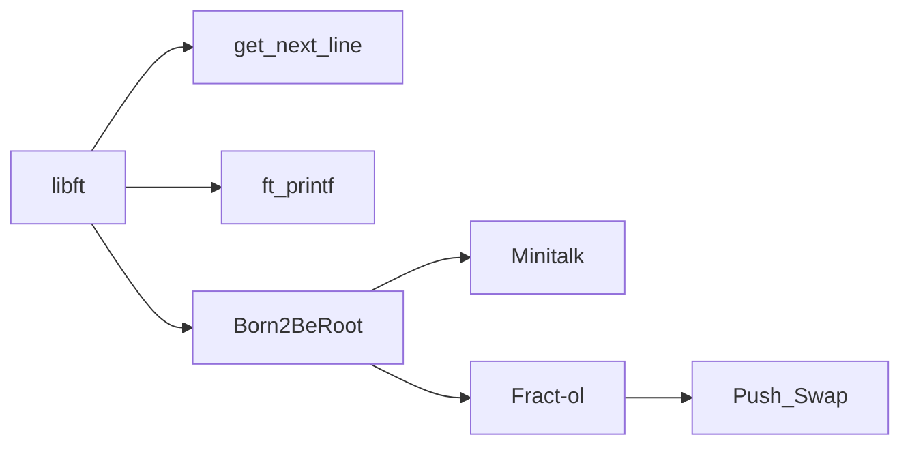

# 42 Common Core Index

|Current Project|Current Rank|
|--|--|
|Fract-ol|Rank 02|

# Progress Graph

# Index

- [1.0]Rank 01
  - [[1.1]Libft](#libft)
  - [1.2]ft_printf
  - [1.3]Get Next Line
  - [1.4]Born2BeRoot
  - [1.5]Exam 02
- [2.0]Rank 02
  - [2.1]

# libft

