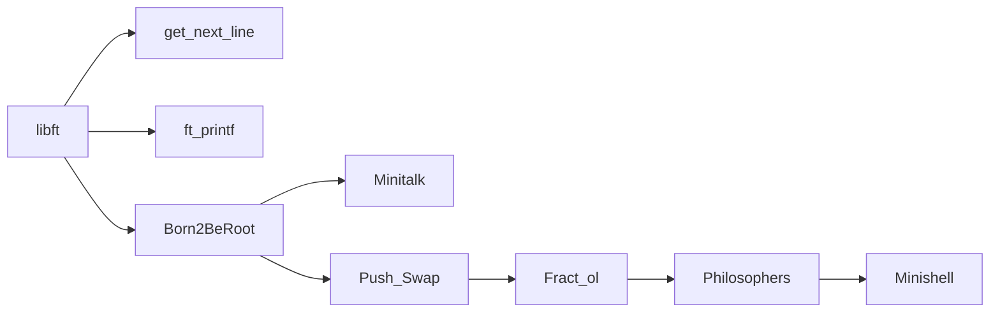

<div align = center>

# 42 Common Core Index

|Current Project|Current Rank|
|--|--|
|Minishell|Rank 03|

# Progress Graph

</div>



---

<div align=center>

# Funsies

</div>

I started the 42 Common Core on the 2nd of October 2023.

I am/was a member of the 42 Porto Student's Association.

I use NVIM but firstly I used VSCode and Clion.

---

<div align=center>

# Norminette

</div>

The Norminette is a set of rules that 42 students have to follow. These rules were made so students would build better looking and better organized code, some of this rules include specific variables names for some elements like strcutures having to start with s_ or global variables having to start with g_. These rules also make for a better experience when trying to help other peers and when evaluating because it makes code easier to read and understand.

<div align=center>

# Moulinette

</div>

The Moulinette is an automated solving bot created by 42 that will evaluate the student throughout the piscine and the first 3 C projects of the common core. It's composed by a series of tests that will check if the code is giving the correct output, it the code doesn't use any forbidden functions and of course if it's according to the norm.

<div align=center>

---

# [Libft](https://github.com/mota494/42_libft)


</div>

Libft is the very first project of the 42 common core and makes the stundent go back to piscine days to recreate a bunch of functions and also introduces the concept of linked lists to the student through the bonus part.

The project is organized in three main parts:
- A set of libc functions
- Some additional 42 functions
- The bonus part

The libc functions contain some usefull functions like `atoi` or `calloc` that will be usefull in every project from the common core, making these are a good way to get back to speed after the months between passing the piscine and starting the cursus

The additional 42 functions aren't functions that already exist so the stundent doesn't have anything to be a guide, this encourages the student to write his own tests and get really creative on trying to break his own code.

The bonus part is a set of functions that revolve around linked lists a concept that will be extremely usefull for everything that's C related as it's a fundamental part of the programming language and also presents the student with new concepts and challenges.

---

<div align = center>

# [ft_printf](https://github.com/mota494/42_ftprintf)


</div>

Everyone that has written an "Hello World!" in C already knowns what printf is, unfurtunately, 42 students are not allowed to use printf and how do we fix that ? Creating our own of course, this project is recreating the basic functionality of printf for the mandatory part and if the student really wants to go beyond the bonus part challenges them by giving a few more things to do.

These project is unlocked right after libft is submitted and evaluated by the Moulinette and it was my 2nd project of common core. It caught me by surprise because the basic functionality of the printf is well, basic, the project makes the student learn about variadic functions a type of function that can receive an arbitrary ammount of argumments.

---

<div align = center>

# [Get Next Line](https://github.com/mota494/42_get_next_line)


</div>

GNL or get next line was my 3rd project on the common core and it was a challenging project because of the norm and also the restraints that are given to the student, these restraints make a project that otherwise be a basic project into a kinda hard and frustrating experience. 

It's a simple function that receives a file descriptor and returns line by line the contents of the file received. Example, if the file has the contents presented below and the functions is called once it will return `42 common core` and if it's ran again it will return `42 norm` and so on.

```file.txt
42 common core
42 norm
42 mouli
```

These project makes the student learn at least a little about file descriptors and also it's the first project that the student will have to run into memory management a key elemment in C.


<div align = center>

# [Born 2 Be Root](https://github.com/mota494/42_Born2BeRoot)


</div>

Born2BeRoot is a very infamous project in 42, some call it their first "nightmare", it's a challenging project that introduces the student to the world of virtualization. It challenges the student by giving a few features that his virtual machine should have and to make that happen the student has to dive down in old forums, documentation pages and discover some neat functionality of the UNIX system. 

The project allows the student to build his virtual machine in Debian or Rocky (RIP centOS), i choose Debian thanks to the more user friendly experience and the great ammount of documentation that already exists since the OS is so loved by a large community

During the project i developed my own B2BR guide that helped some of my peers get through the project.

These was the last project before my first exam, this index will not talk about my exams.

<div align = center>

# [Minitalk](https://github.com/mota494/42_minitalk)


</div>

Minitalk is a project that has as it's main challenge learning about UNIX signals. It has as an end goal to create a communication between two terminals, a server that receives and shows a message that was sent by the client that receives the server's PID and then a message and sends it to the server.

This was the last project that i developed when 42 Porto was still on Critical Techworks office, and the project that i had to submit for evaluation 4 times because i just kept forgetting some minor stuff.

<div align = center>

# [Push_Swap](https://github.com/mota494/42_push_swap)


</div>

I HATED THIS PROJECT but after finishing it I actually learned to love it and find it way more interesting and fun to do.

This project teaches the student about sorting algorithms, efficent programming and stacks (fun).

There's a bunch of sorting algorithms that the student can choose to adapt or even create his own (don't), my pipeline was starting with something that I developed wich was god awful, after that I messed with the Radix a sorting algorithm that divides the number by their individual digits and it actually worked pretty good but with my solution I wouldn't have the 100 out of 100 grade so I discarded that and ended doing the Turk Algorithm which... I actually hate because it's boring but a man gotta do what he's gotta do   

<div align = center>

# [Fract-ol](https://github.com/mota494/42_fractol)


</div>

The choice between so_long, FDF and Fract_Ol was always clear as day for me and since I started the cursus I was looking forward to it!

Unfortunately I started fractl_ol at a time that I was struggling to find motivitation to start the project and even after starting it I wasn't really feeling good myself and ended up pushing Fract_ol aside to complete another project that I pushed to the side.

After months struggling with motivation, one day I randomly decided to pick it up again and finished it way faster than I thought I would.

As the name implies, this project is about fractals, it's the first project that uses the infamous _MiniLBX_ a simple C graphics library developed for 42 students.

After finishing this project my "season 1" of 42 came to an end and I took a 2 month break from the cursus.

<div align = center>

# [Philosophers](https://github.com/mota494/42_philosophers)


</div>

2024 was a garbage year, since the beggining of my cursus, 2/09/2023 untill the closure of the first 42 Porto campus on the 9/02/2024 I managed to hand 5 projects and 1 exam but after that it was a massive downhill for me. I managed to take 10 months to hand fract-ol and push_swap which was way more time than I should've taken, but there's no need to beat around a dead bush now.

Philosophers was fun, a bit frustrating havind to deal with data races and learning about threads but I had fun and it was a really good project to pick up the pace again after my slump

<div align = center>

# [Minishell](https://github.com/mota494/42_minishell)


</div>

(IN PROGRESS)
